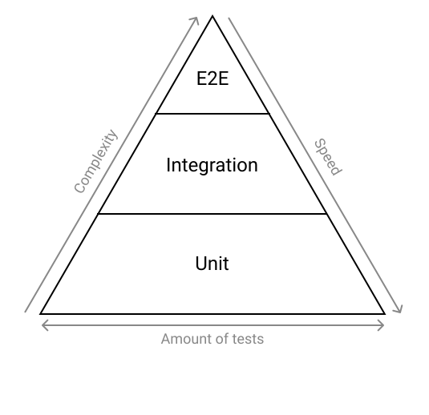

# Testing principles

This file documents how we test code at Sourcegraph.

_For practical information on how we test things in the [sourcegraph/sourcegraph](https://github.com/sourcegraph/sourcegraph) repository, see "[Testing](testing.md)"._

## Philosophy

We rely on automated testing to ensure the quality of our product.

Any addition or change to our codebase should be covered by an appropriate amount of automated tests to ensure that:

1. Our product and code works as intended when we ship it to customers.
1. Our product and code doesn't accidentally break as we make changes over time.

A good automated test suite increases the velocity of our team because it allows engineers to confidently edit and refactor code, especially code authored by someone else.

Engineers should budget an appropriate amount of time for writing tests when making iteration plans.

## Flaky tests

A *flaky* test is defined as a test that is unreliable or non-deterministic, meaning that it doesn't consistently produce the same pass/fail result.

Typical reasons why a test may be flaky:

- Race conditions or timing issues
- Caching or inconsistent state between tests
- Unreliable test infrastructure (such as CI)
- Reliance on third-party services that are inconsistent

We do not tolerate flaky tests of any kind. Any engineer that sees a flaky test should immediately:

1. Open a PR to disable the flaky test.
1. Open an issue to re-enable the flaky test, assign it to the most likely owner, and add it to the current release milestone.

If the build or test infrastructure itself is flaky, then [open an issue](https://github.com/sourcegraph/sourcegraph/issues/new?labels=team/distribution) and notify the [distribution team](distribution/index.md#contact).

Why are flaky tests undesirable? Because these tests stop being an informative signal that the engineering team can rely on, and if we keep them around then we eventually train ourselves to ignore them and become blind to their results. This can hide real problems under the cover of flakiness.

## Testing pyramid

### Unit tests

Unit tests test individual functions in our codebase and are the most desirable kind of test to write.

Benefits:

- They are usually very fast to execute because slow operations can be mocked.
- They are the easiest tests to write, debug, and maintain because the code under test is small.
- They only need to run on changes that touch code which could make the test fail, which makes CI faster and minimizes the impact of any [flakiness](#flaky-tests).

Tradeoffs:

- They don't verify our systems are wired up correctly end-to-end.

### Integration tests

Integration tests test the behavior of a subset of our entire system to ensure that subset of our system is wired up correctly.

Benefits:

- To the extent that fewer systems are under test compared to e2e tests, they are faster to run, easier to debug, have clearer ownership, and less vulnerable to [flakiness](#flaky-tests).
- They only need to run on changes that touch code which could make the test fail, which makes CI faster and minimizes the impact of any [flakiness](#flaky-tests).

Tradeoffs:

- They don't verify our systems are wired up correctly end-to-end.
- They are not as easy to write as unit tests.

Examples:

- Tests that call our search API to test the behavior of our entire search system.
- Tests that validate UI behavior in the browser while mocking out all network requests so no backend is required.

#### Running integration tests

Integration tests are run everytime a branch is merged into main, but it is possible to run them manually:

- Create a branch with the `master-dry-run/` prefix, example: `master-dry-run/my-feature`
- Push it on Github
- Look for that branch on [Buildkite](https://buildkite.com/sourcegraph/sourcegraph)

### End-to-end tests (e2e)

E2e tests test our entire product from the perspective of a user. We try to use them sparingly. Instead, we prefer to get as much confidence as possible from our [unit tests](#unit-tests) and [integration tests](#integration-tests).

Benefits:

- They verify our systems are wired up correctly end-to-end.

Tradeoffs:

- They are typically the slowest tests to execute because we have to build and run our entire product.
- They are the hardest tests to debug because failures can be caused by a defect anywhere in our system. This can also make ownership of failures unclear.
- They are the most vulnerable to [flakiness](#flaky-tests) because there are a lot of moving parts.

Examples:

- Run our Sourcegraph Docker image and verify that site admins can complete the registration flow.
- Run our Sourcegraph Docker image and verify that users can sign in and perform a search.

### Visual testing

We use [Percy](https://percy.io/) to detect visual changes in Sourcegraph features. You may need permissions to update screenshots if your feature introduces visual changes. Post a message in #dev-chat that you need access to Percy, and someone will add you to our organization (you will also receive an invitation via e-mail). _Do not_ create an account on Percy before receiving the invitation: as Percy has been acquired by BrowserStack, if you create an account outside of the invitation flow, you will end up with a BrowserStack account that cannot be added to a Percy organization.

Once you've been invited to the Sourcegraph organization and created a Percy account, you should then link it to your GitHub account.

## Ownership

- [Distribution team](distribution/index.md) owns build and test infrastructure.
- [Web team](web/index.md) owns any tests that are driven through the browser.

## Conventions

- **Naming tests in Go code.** We strive to follow the same naming convention for Go test functions as described for [naming example functions in the Go testing package](https://golang.org/pkg/testing/#hdr-Examples).

## See also

- [Documentation for running tests in sourcegraph/sourcegraph](https://docs.sourcegraph.com/dev/background-information/testing)
- [Go-specific testing guide](./languages/testing_go_code.md)
- [Web-specific testing guide](./web/testing.md)
