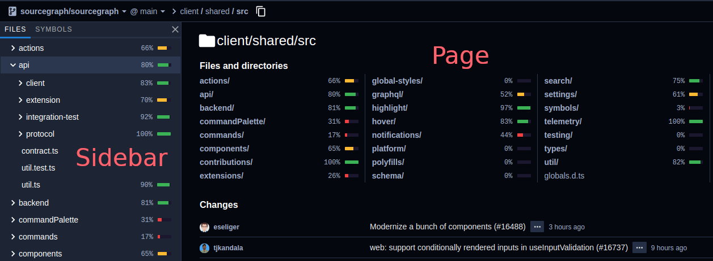

# File decorations tutorial



Extensions can decorate files in the file tree and/or directory page with text content and/or a `<meter/>` element. In this tutorial, you'll build an extension that decorates directories with the length of their names.

Caveat: file decorations are only displayed on Sourcegraph, not on code hosts.

## Prerequisites

This tutorial presumes you have created and published an extension. If not, complete the [Hello world tutorial](hello_world.md) first.

## Set up

You can skip this section if you have already set up an extension.

Create the extension you'll use for this tutorial:

```
mkdir file-decorator
cd file-decorator
npm init sourcegraph-extension
```

Then publish your extension:

```
src extension publish
```

Confirm your extension is enabled and working by:

- Opening the extension detail page.
- Viewing a file on Sourcegraph.com and confirming the hover for your extension appears.

## Register a file decoration provider

On [activation](../activation.md), register a [file decoration provider](https://unpkg.com/sourcegraph@24.8.0/dist/docs/interfaces/_sourcegraph_.filedecorationprovider.html): 

```ts
import * as sourcegraph from 'sourcegraph'

export function activate(context: sourcegraph.ExtensionContext): void {
    context.subscriptions.add(
        // Register a file decoration provider whose `provideFileDecorations` method is called
        // with a list of files that can be decorated
        sourcegraph.app.registerFileDecorationProvider({
            // `provideFileDecorations` should return an array of file decorations
            provideFileDecorations: ({ files }) => (
                    files
                        // Let's only decorate directories
                        .filter(file => file.isDirectory)
                        .map(file => ({
                            // We must include the file's resource identifier
                            uri: file.uri,
                            // Decorate entries with text content with the `after` property
                            after: {
                                contentText: `length: ${file.path.split('/').pop()?.length ?? 0}`,
                            },
                        }))
                ),
        })
    )
}
```

File decoration providers are called with a new list of files whenever a user expands the file tree or visits new directory pages.

### `after`

As we've seen in the previous section, file decorations can add text content after filenames with the [`after`](https://unpkg.com/sourcegraph@24.8.0/dist/docs/interfaces/_sourcegraph_.filedecoration.html#after) property. File decorations can [customize text color](https://unpkg.com/sourcegraph@24.8.0/dist/docs/interfaces/_sourcegraph_.filedecorationattachmentrenderoptions.html) and specify color overrides for dark and/or light themes.

### `meter`

A file decoration can render a [`<meter/>`](https://unpkg.com/sourcegraph@24.8.0/dist/docs/interfaces/_sourcegraph_.filedecoration.html#meter) element after filenames as well. Read through the [Codecov Sourcegraph extension](https://sourcegraph.com/github.com/codecov/sourcegraph-codecov/-/blob/src/extension.ts#L227-309) to see how `meter` is used in real-world extensions.

### Asynchronous or streaming file decorations

File decoration providers don't have to synchronously return an array of file decorations. 

- If you need to perform asynchronous operations before resolving your file decorations, you can return a `Promise`. 
- If you need to update your file decorations over time (streaming), you can return an `AsyncIterable` or a [`Subscribable`](https://unpkg.com/sourcegraph@24.8.0/dist/docs/interfaces/_sourcegraph_.subscribable.html) (e.g. RxJS Observable)

[See the types of supported provider results](https://unpkg.com/sourcegraph@24.8.0/dist/docs/index.html#providerresult)

## Decoration location

You can restrict where an individual file decoration is displayed by setting the [`where`](https://unpkg.com/sourcegraph@24.8.0/dist/docs/interfaces/_sourcegraph_.filedecoration.html#where) property:

- `"sidebar"`: Only display the decoration on the file tree sidebar
- `"page"`:  Only display the decoration on the directory page
- If `where` isn't defined, the decoration will be displayed on both the file tree sidebar and the directory page

## Summary

You've now learned how to decorate filenames on Sourcegraph with Sourcegraph extensions!

## Next Steps

- [Extension activation](../builtin_commands.md)
- [Buttons and custom commands tutorial](button_custom_commands.md)
- [Extension contribution points](../contributions.md)
- [Builtin commands](../builtin_commands.md)
