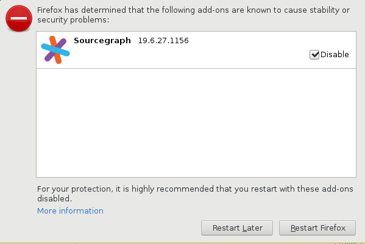

# Sourcegraph Firefox Add-on security

## Why is Firefox flagging the Sourcegraph add-on as unsafe?

> _Firefox has determined that the following add-ons are known to cause stability or security problems_

The Sourcegraph Firefox add-on has been flagged as unsafe by Mozilla because of a compliance issue with Mozilla's policy regarding [add-on development practices](https://developer.mozilla.org/en-US/docs/Mozilla/Add-ons/AMO/Policy/Reviews#Development_Practices). This issue is specifically related to how we have chosen to implement Sourcegraph extensions.

We made Sourcegraph extensions centrally managed by your Sourcegraph instance, not individually managed in your Firefox profile. Our customers are companies that roll out the browser extension to all employees, and asking each employee to individually manage Sourcegraph settings in Firefox would be too complex and present more security problems than central management.

## What are Sourcegraph extensions, and who can author them?

Sourcegraph extensions provide a way to extend the functionality of both a Sourcegraph instance and our browser add-on by writing JavaScript code against the Sourcegraph extension API. Sourcegraph uses extensions to implement some core features, for example, code intelligence extensions for different languages. Sourcegraph extensions also provide an opportunity for third-party developers to extend Sourcegraph's functionality.

In the Sourcegraph extension registry, users can always examine the JavaScript bundle of the extension, and, if provided by the author, its source repository. Extensions are always opt-in, except for trusted language extensions providing code intelligence that are written and maintained by Sourcegraph.

Sourcegraph site admins can opt to [only allow specific extensions](https://docs.sourcegraph.com/admin/extensions#allow-only-specific-extensions-from-sourcegraph-com) from the sourcegraph.com public extension registry, or to disable extensions from the public registry altogether. Additionally, enterprise customers can opt to maintain a private extension registry to host trusted extensions privately.

## Mozilla add-on policies and the Sourcegraph extension security model

In their add-on development policies, Mozilla specifically mentions remote code execution:

> Add-ons must be self-contained and not load remote code for execution.

Sourcegraph extensions are executed from remote code, but their execution environment is restricted:

*   Sourcegraph extension JavaScript bundles are hosted on a Sourcegraph instance (either sourcegraph.com, or a self-hosted instance for Enterprise customers using the private extension registry)
*   The JavaScript bundles are fetched at runtime, and executed in a WebWorker in the add-on’s background page, using `WebWorkerGlobalScope.importScripts()`
    *   Executing in the background page ensures extensions never have access to your browsing context. They cannot manipulate the DOM, or make same-origin requests on websites you visit.
    *   The sandboxed scope of the WebWorker means Sourcegraph extensions can’t interact with the WebExtension APIs.
    *   The extension’s interactions are strictly restricted to what is defined in the [Sourcegraph extension API](https://sourcegraph.com/github.com/sourcegraph/sourcegraph/-/blob/packages/sourcegraph-extension-api/src/sourcegraph.d.ts).

The above, third-party extensions being opt-in, and users always being able to inspect the bundle of Sourcegraph extensions when they enable them, makes us confident that Sourcegraph extensions do not negatively impact our users’ browsing safety.

Mozilla’s main objection to our execution model is the fact that extensions upgrade automatically without user interaction, so the add-on will always fetch the latest version of the extension from your Sourcegraph instance. In order to be compliant, we would need to change this so that users always have to manually review and approve extension updates. This is a change we are not planning to implement at this time.

## What should I do?

We know that Sourcegraph users are a very technical audience, so we hope the above information will help you make an informed decision on whether to keep using the Sourcegraph Firefox add-on. Additionally, our add-on is [fully open source](https://github.com/sourcegraph/sourcegraph/tree/master/browser), and you should feel free to inspect the source code if you have any other concerns.

If you decide that you are comfortable trusting the Sourcegraph Mozilla Firefox add-on:

*   When you see the pop up recommending you disable Sourcegraph, uncheck the disable option.

OR

*   If you already restarted with the Sourcegraph add-on disabled, you can go to your addons page (i.e. type `about:addons` in the Firefox address bar) and re-enable Sourcegraph.
